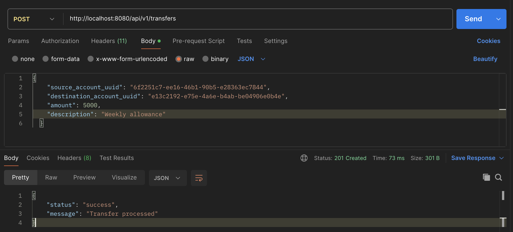
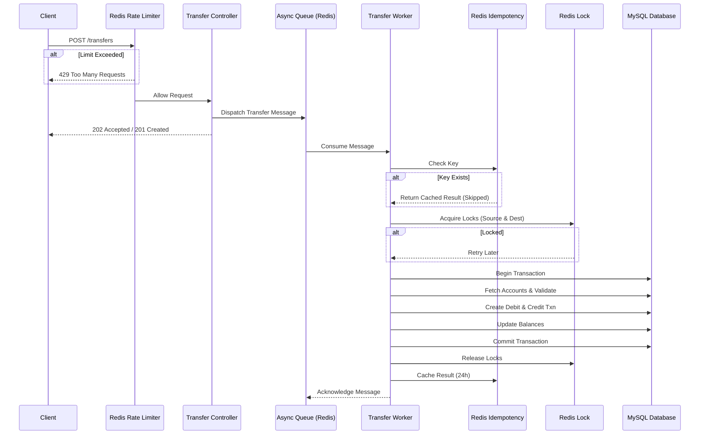

# Secure Fund Transfer API

A secure, production-ready fund transfer API built with **PHP 8.4**, **Symfony 7.4**, **MySQL 8.0**, and **Redis** for high performance and scalability. This API follows **SOLID principles** and **Domain-Driven Design (DDD)**.



## 🚀 Features

### Core Banking
- ✅ **Double-Entry Bookkeeping** - Every transfer creates both debit and credit transactions
- ✅ **Pessimistic Locking** - Prevents race conditions using Redis distributed locks (10x faster than DB locks)
- ✅ **Idempotency** - Duplicate requests are safely rejected using Redis-baked idempotency keys (50x faster)
- ✅ **Event-Driven Architecture** - Transfer completion/failure events for extensibility
- ✅ **Comprehensive Validation** - Currency matching, account status, sufficient funds, self-transfer prevention

### Performance & Security
- ✅ **Rate Limiting** - Distributed rate limiting via Redis (10 requests per minute)
- ✅ **Async Processing** - Transfers processed in background via Symfony Messenger with Redis transport
- ✅ **Type Safety** - Enums for status and currency, DTOs for requests, Value Objects for Money
- ✅ **API Key Authentication** - Header-based authentication for all critical endpoints

### Infrastructure
- ✅ **Database Migrations** - Version-controlled schema changes with Doctrine
- ✅ **Health Check Endpoint** - Monitor server, database, and Redis connectivity
- ✅ **Full Test Coverage** - Unit and integration tests for all scenarios
- ✅ **Docker Support** - Easy deployment with Docker Compose (PHP, Nginx, MySQL, Redis)

## 🏗 Architecture

### Middleware
Request processing is handled by Attribute-based middleware hook into `KernelEvents::CONTROLLER`.
- `#[RequiresApiKey]`: Enforces authentication.
- `#[RateLimit]`: Enforces API rate limits.
- `#[Idempotent]`: Ensures request idempotency.

### Tech Stack
- **PHP 8.4** with strict types and readonly properties
- **Symfony 7.4** framework
- **MySQL 8.0** database (Transactions & Storage)
- **Redis 7** (Caching, Locking, Rate Limiting, Messaging)
- **Doctrine ORM** for database abstraction
- **Symfony Messenger** for async processing
- **Docker & Docker Compose** for containerization

### Domain-Driven Design (DDD)
- **Entities**: `Account`, `Transaction` with rich domain logic
- **Value Objects**: `Money` with currency-aware operations
- **Repositories**: Data access abstraction without business logic
- **Services**: `TransferService` encapsulates core business logic
- **Events**: `TransferCompletedEvent`, `TransferFailedEvent`

---

## 🚦 Getting Started

### Prerequisites
- Docker & Docker Compose
- TablePlus or any MySQL client (optional)

### Installation

1. **Clone the repository**
   ```bash
   git clone <repo-url>
   cd transfer
   ```

2. **Start Docker containers**
   ```bash
   docker-compose up -d
   ```

3. **Install dependencies**
   ```bash
   docker-compose exec php composer install
   ```

4. **Run database migrations**
   ```bash
   docker-compose exec php php bin/console doctrine:migrations:migrate --no-interaction
   ```

5. **Create sample accounts**
   ```bash
   docker-compose exec php php bin/console doctrine:fixtures:load --no-interaction
   ```

6. **Start the Async Worker** (Required for processing transfers)
   ```bash
   docker-compose exec php php bin/console messenger:consume async -vv
   ```

---

## 🔄 Transfer Flow

The API uses a secure, asynchronous transfer flow to ensure high performance and data integrity.

### Sequence Diagram



---

## 📡 API Endpoints

### 1. Health Check
Monitor the status of the API, Database, and Redis.

**Request:**
```http
GET /api/health
```

**Response (200 OK):**
```json
{
  "status": "healthy",
  "checks": {
    "server": "ok",
    "database": "ok",
    "redis": "ok"
  }
}
```

### 2. Create Transfer
Initiate a new fund transfer.

**Request:**
```http
POST /api/v1/transfers
Content-Type: application/json
X-API-Key: dev_secret_key_12345
X-Idempotency-Key: {{unique_uuid_v4}}

{
  "source_account_uuid": "123e4567-e89b-12d3-a456-426614174000",
  "destination_account_uuid": "123e4567-e89b-12d3-a456-426614174001",
  "amount": 5000,
  "description": "Payment for services"
}
```

**Response (201 Created):**
```json
{
  "status": "success",
  "message": "Transfer processed"
}
```

---

## 🧪 Testing

### Run All Tests
```bash
docker-compose exec php vendor/bin/phpunit
```

### Run Unit Tests
```bash
docker-compose exec php vendor/bin/phpunit --testsuite Unit
```

### Run Integration Tests
```bash
docker-compose exec php vendor/bin/phpunit --testsuite Integration
```

---

## 🛠 Configuration

Environment variables are managed in `.env`.

| Variable | Description | Default (Dev) |
|----------|-------------|---------------|
| `APP_ENV` | Application Environment | `dev` |
| `DATABASE_URL` | MySQL Connection String | `mysql://transfer_user...` |
| `REDIS_URL` | Redis Connection String | `redis://redis:6379` |
| `MESSENGER_TRANSPORT_DSN` | Messenger Transport | `redis://redis:6379/messages` |
| `LOCK_DSN` | Distributed Lock DSN | `redis://redis:6379` |
| `AUTH_API_KEY` | Secret API Key for Auth | `dev_secret_key_12345` |

---

## 🔐 Security Features

1. **Authentication**: All transfer requests require verify valid `X-API-Key`.
2. **Rate Limiting**: Redis-backed sliding window limiter prevents abuse.
3. **Idempotency**: Prevents double-spending by tracking unique keys in Redis.
4. **Distributed Locking**: Ensures no two processes modify the same account simultaneously.
5. **Input Validation**: Strict typing and validation using Symfony Validator.
6. **SQL Injection Protection**: Uses Doctrine ORM prepared statements.

## 📦 Database Schema

### Accounts
- `uuid` (PK), `holder_name`, `balance` (cents), `currency` (USD/EUR), `status`, `version`

### Transactions
- `uuid` (PK), `account_id` (FK), `amount` (signed), `status`, `idempotency_key`, `created_at`

---

### License
Proprietary
